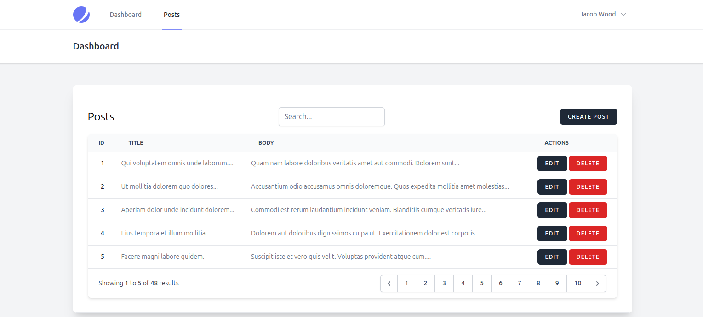
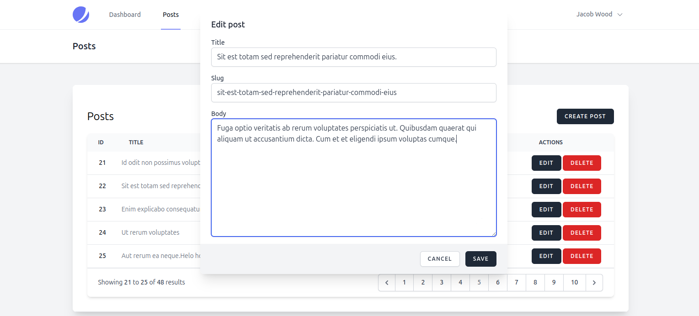
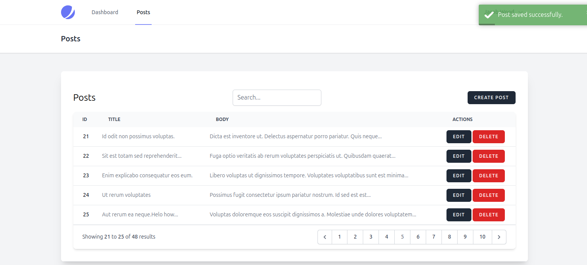
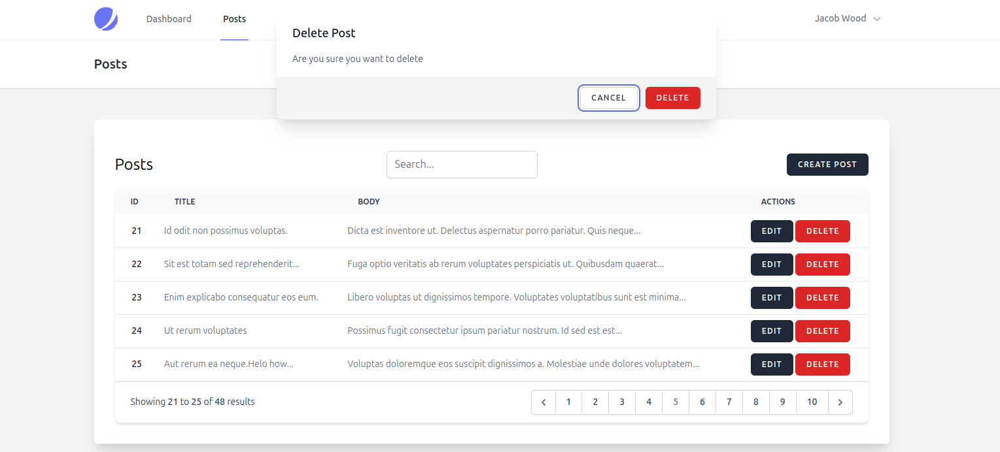
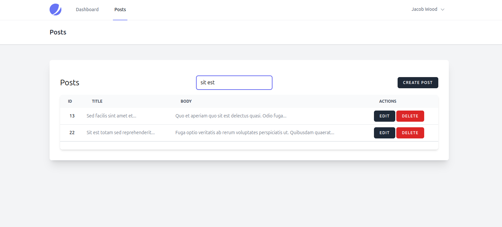

# Crud Application in Laravel 11 Livewire v3 with form object

This application is built using Laravel v11 and Livewire v3, with Jetstream for authentication and team management. It includes CRUD functionality for managing posts.

## Features
- **Laravel v11**: The latest version of Laravel for robust and scalable web applications.
- **Livewire v3**: A full-stack framework for Laravel that makes building dynamic interfaces simple, without leaving the comfort of Laravel.
- **Jetstream**: Provides a great starting point for your Laravel applications with authentication, team management, and more.
- **Post CRUD**: Create, read, update, and delete posts within the application.


## Installation Guide

### Prerequisites
- PHP >= 8.0
- Composer
- Node.js & NPM
- MySQL or any other database

### Steps

1. **Clone the repository**:
    ```sh
    git clone https://github.com/aqibhussain441/livewire-crud.git
    cd your-laravel-app
    ```

2. **Install dependencies**:
    ```sh
    composer install
    npm install
    ```

3. **Set up environment variables**:
    - Copy the `.env.example` file to `.env`:
        ```sh
        cp .env.example .env
        ```
    - Update the `.env` file with your database and other environment settings.

4. **Generate application key**:
    ```sh
    php artisan key:generate
    ```

5. **Run database migrations**:
    ```sh
    php artisan migrate
    ```

6. **Seed the database (if applicable)**:
    ```sh
    php artisan db:seed
    ```

7. **Build the front-end assets**:
    ```sh
    npm run dev
    ```

8. **Run the application**:
    ```sh
    php artisan serve
    ```
    - Visit `http://localhost:8000` in your browser.

**Register as new user to access the dashboard and post crud**

## Screenshots

### Posts List


### Post Form to update or create


### Toast Notification


### Confirm Dialogue


### Search In Table



